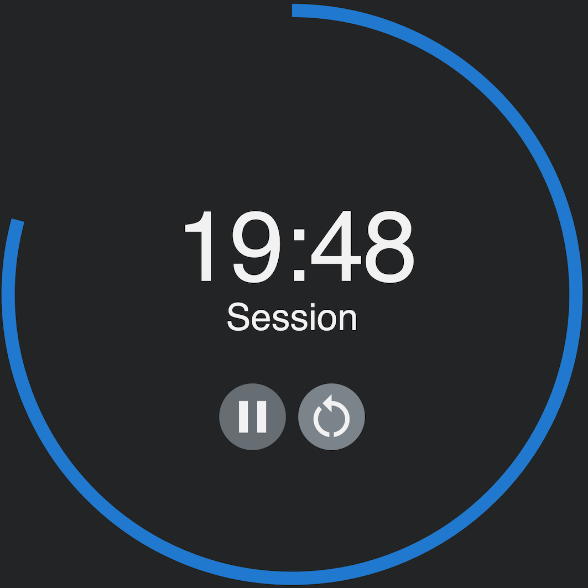
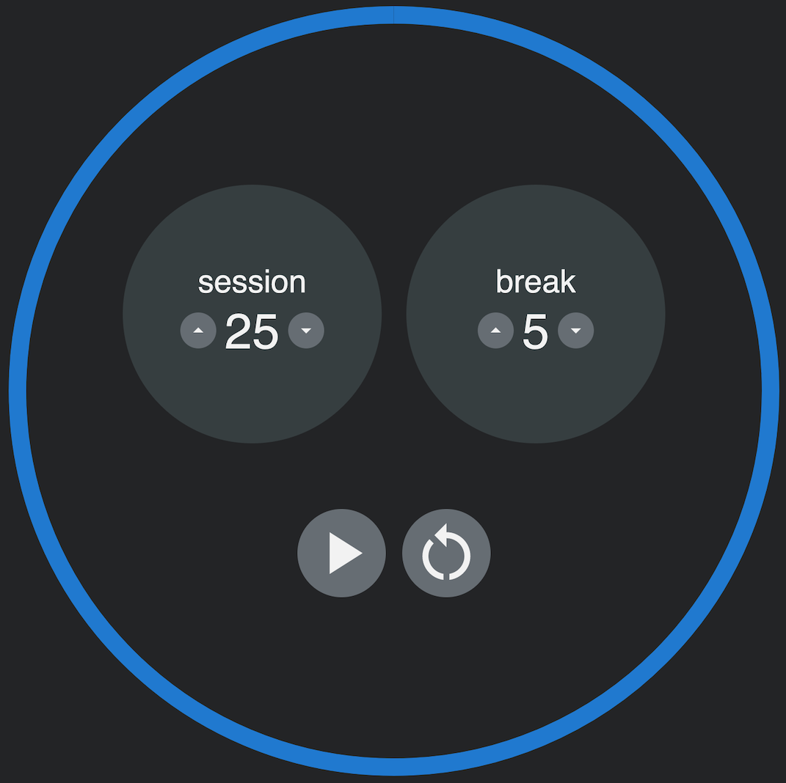

# freeCodeCamp 25 + 5 Clock

This project was written to fulfill the requirements of the [freeCodeCamp 25 + 5 Clock](https://www.freecodecamp.org/learn/front-end-development-libraries/front-end-development-libraries-projects/build-a-25--5-clock) coding challenge. It is a continuously running timer that alternates between a "session" and "break". Useful for conferences/meetings as was as [HIIT](https://en.wikipedia.org/wiki/High-intensity_interval_training) workouts.

It was written in react.js with a little help from the [Material User Interface](https://mui.com) library.

Check out the [demo](https://qy741.csb.app/) or [codesandbox](https://codesandbox.io/s/fcc-25-5-clock-qy741).

